# 🏛️ Arquitetura C4 — JP Mall

> Documento de arquitetura do **JP Mall**, um sistema de **gestão de sinistros e ocorrências** de um shopping center.
>
> Frontend **React + Vite + TypeScript** • Backend **Go + chi v5** • Banco **PostgreSQL + pgx/v5**.
>
> Este arquivo foi escrito em formato Markdown para ser versionado no GitHub e lido diretamente pela equipe de desenvolvimento.

---

## 📌 Objetivo deste documento

Este documento apresenta a arquitetura do projeto usando o **C4 Model**, explicando:

- quem usa o sistema;
- quais são as partes principais da aplicação;
- como o frontend se comunica com a API;
- como a API se conecta ao banco de dados;
- como funciona o fluxo de autenticação;
- como um sinistro é registrado no sistema;
- quais pontos técnicos precisam de atenção antes da entrega final.

---

## 📖 O que é o JP Mall

O **JP Mall** é um sistema web para controle de **sinistros e ocorrências** em um shopping center.

Na prática, ele permite que usuários internos do shopping registrem ocorrências, acompanhem o histórico dos sinistros, vinculem lojas envolvidas, anexem evidências, consultem notificações, visualizem indicadores em dashboard e gerem relatórios operacionais.

O sistema é dividido em três partes principais:

| Parte | Responsabilidade |
|---|---|
| **Frontend** | Interface usada no navegador pelo usuário. |
| **Backend/API** | Regras de negócio, autenticação, rotas REST e comunicação com o banco. |
| **Banco de Dados** | Armazenamento de usuários, lojas, sinistros, notificações e registros relacionados. |

---

## 🧭 O que é o C4 Model

O **C4 Model** é uma forma de documentar arquitetura de software em níveis de zoom:

| Nível | Nome | Pergunta que responde |
|---|---|---|
| 1 | **Contexto** | Quem usa o sistema e com o que ele se relaciona? |
| 2 | **Contêiner** | Quais aplicações, bancos e serviços formam o sistema? |
| 3 | **Componente** | Quais módulos existem dentro de cada contêiner? |
| 4 | **Código** | Como o código está organizado nos arquivos e pastas principais? |

Além desses níveis, este documento também inclui diagramas de fluxo dinâmico, implantação, rotas da API, checklist e FAQ.

---

## 1. 🌍 Diagrama de Contexto do Sistema

> Visão mais distante da arquitetura. Mostra o JP Mall como uma única caixa e quem interage com ele.

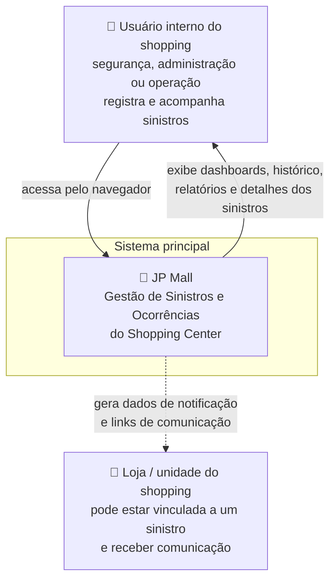

### Resumo

- O **usuário interno** acessa o sistema pelo navegador.
- O **JP Mall** centraliza registros de sinistros, evidências, lojas, notificações e relatórios.
- A **loja/unidade** aparece como entidade relacionada ao sinistro, mas não necessariamente como usuária direta do sistema.
- O sistema não depende de integração externa obrigatória para funcionar; a base principal é o próprio backend e o PostgreSQL.

---

## 2. 📦 Diagrama de Contêiner

> Aqui abrimos a caixa do sistema e enxergamos as partes grandes que compõem a aplicação.

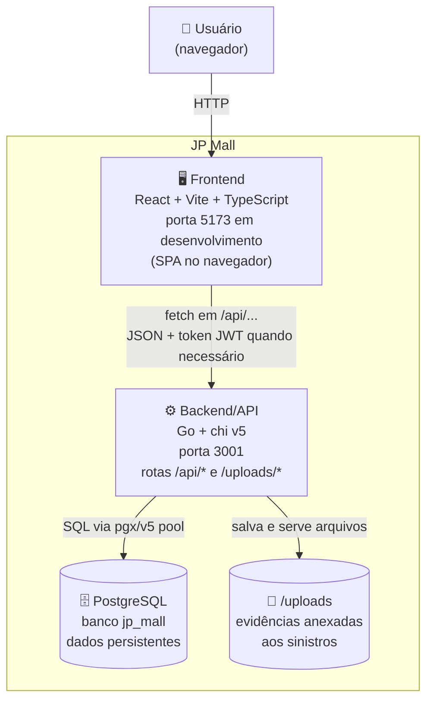

### Contêineres principais

| Contêiner | Tecnologia | Função |
|---|---|---|
| **Frontend** | React, Vite, TypeScript, React Router, shadcn/ui | Exibe telas como login, dashboard, novo sinistro, histórico, detalhes e relatórios. |
| **Backend/API** | Go, chi v5, middlewares, JWT, pgx/v5 | Recebe requisições HTTP, valida regras, autentica usuários e acessa o banco. |
| **Banco de Dados** | PostgreSQL | Armazena usuários, lojas, sinistros, notificações, trilha de auditoria e dados dos relatórios. |
| **Uploads** | Pasta local servida pelo backend | Guarda evidências/anexos vinculados aos sinistros. |

---

## 3. 🔁 Como o Frontend se conecta à API

Em desenvolvimento, a aplicação roda com **dois processos principais**:

| Processo | Comando típico | Porta | Responsabilidade |
|---|---|---:|---|
| **Backend Go** | `cd backend && go run .` | `3001` | Servir a API REST em `/api/*` e arquivos em `/uploads/*`. |
| **Frontend Vite** | `cd frontend && pnpm dev` | `5173` | Servir a SPA React durante o desenvolvimento. |

O frontend faz chamadas com caminho relativo, por exemplo:

```ts
fetch('/api/claims')
```

Isso evita espalhar `http://localhost:3001` pelo código. O Vite pode interceptar chamadas que começam com `/api` e encaminhar para o backend.

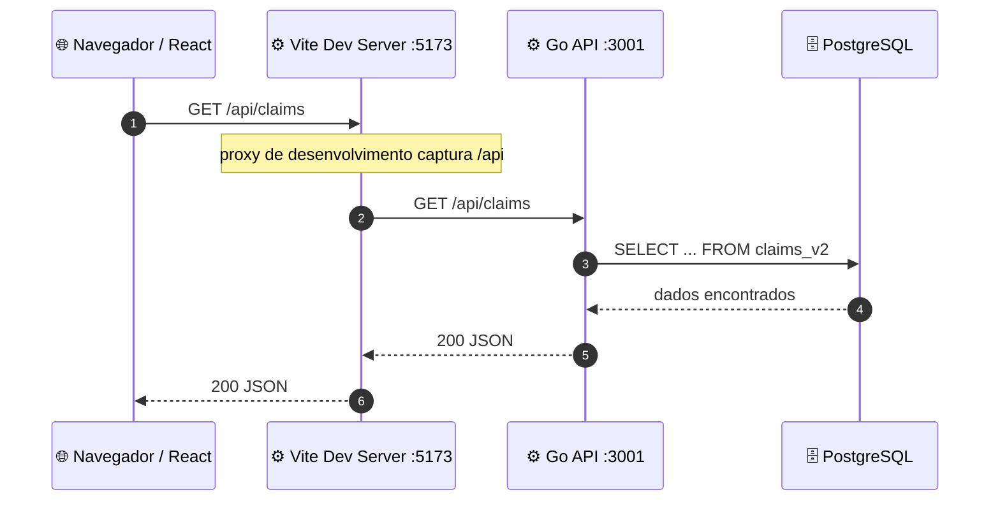

> ⚠️ **Atenção:** se o `vite.config.ts` estiver apontando `/api` para `http://localhost:8080`, mas o backend estiver subindo em `:3001`, o frontend não conseguirá conversar com a API. Nesse caso, alinhe os dois lados: ou altere o proxy para `http://localhost:3001`, ou suba o backend na porta `8080`.

---

## 4. 🧩 Diagrama de Componentes — Backend

> Agora damos zoom dentro do backend Go.

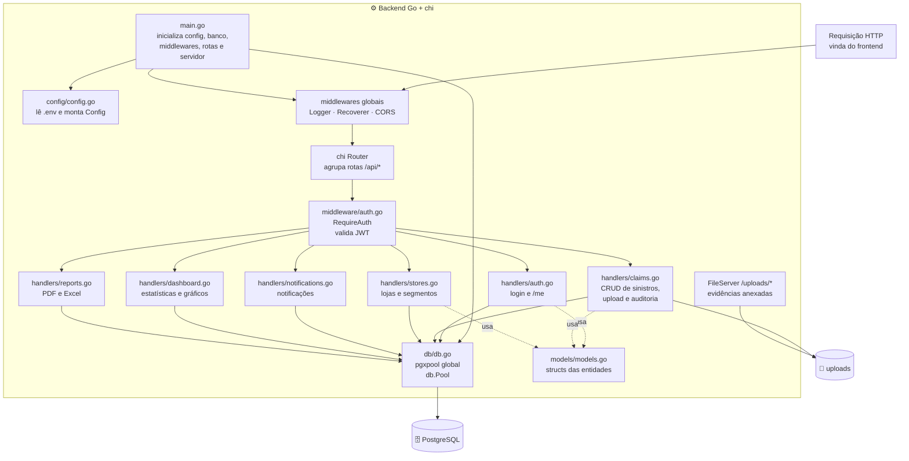

### Responsabilidades principais do backend

| Componente | Responsabilidade |
|---|---|
| `main.go` | Ponto de entrada da API. Carrega configuração, conecta no banco, registra middlewares e inicia o servidor. |
| `config/config.go` | Lê variáveis de ambiente, como porta, JWT, DSN do banco e configurações auxiliares. |
| `db/db.go` | Cria e disponibiliza o pool global de conexões com PostgreSQL usando `pgx/v5`. |
| `middleware/auth.go` | Valida token JWT e injeta as informações do usuário no contexto da requisição. |
| `handlers/auth.go` | Login e consulta do usuário autenticado. |
| `handlers/claims.go` | CRUD de sinistros, upload de evidências e trilha de auditoria. |
| `handlers/stores.go` | Consulta e atualização de lojas/unidades. |
| `handlers/notifications.go` | Criação, listagem e marcação de notificações como lidas. |
| `handlers/dashboard.go` | Agregações para indicadores e gráficos. |
| `handlers/reports.go` | Geração/exportação de relatórios em PDF e Excel. |
| `models/models.go` | Define as structs usadas pelos handlers. |

---

## 5. 🧩 Diagrama de Componentes — Frontend

> Agora damos zoom dentro da SPA React.

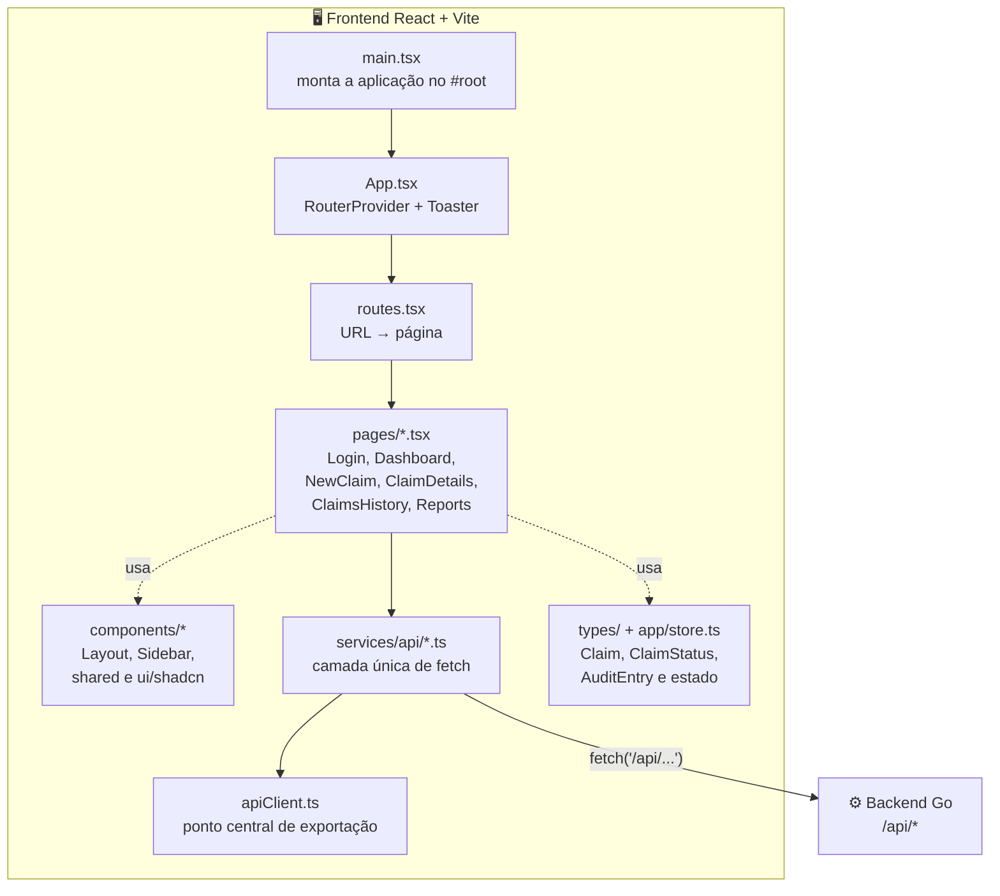

### Organização do frontend

| Camada | Papel |
|---|---|
| `main.tsx` | Inicializa o React e renderiza a aplicação. |
| `App.tsx` | Centraliza o roteador e providers globais. |
| `routes.tsx` | Define as rotas de navegação. |
| `pages/*.tsx` | Telas principais do sistema. |
| `components/*` | Componentes reutilizáveis de layout e interface. |
| `services/api/*.ts` | Única camada que deve fazer chamadas HTTP. |
| `types/*` | Tipos TypeScript usados pelo frontend. |

### Regra importante

As páginas **não devem chamar `fetch` diretamente**. O ideal é que toda comunicação com o backend passe por `services/api/*.ts`, mantendo a interface separada da lógica de integração.

---

## 6. 🔬 Diagrama de Código — Fluxo de um Sinistro

> Este nível mostra como os arquivos principais participam do fluxo de criação de um sinistro.

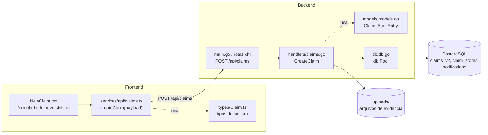

### Explicação

1. O usuário preenche o formulário em `NewClaim.tsx`.
2. A tela chama `createClaim(payload)` em `services/api/claims.ts`.
3. O serviço envia `POST /api/claims` para o backend.
4. A rota chega ao handler `CreateClaim`.
5. O backend valida dados, processa anexos, gera ID do sinistro, cria trilha de auditoria e grava no banco.
6. O banco persiste o sinistro e seus relacionamentos.
7. O frontend recebe a resposta e atualiza a interface.

---

## 7. 🔐 Autenticação com JWT

O login é feito pela rota pública `POST /api/auth/login`. Após autenticar, o backend retorna um token JWT. Esse token deve ser enviado nas rotas protegidas usando o header:

```http
Authorization: Bearer <token>
```

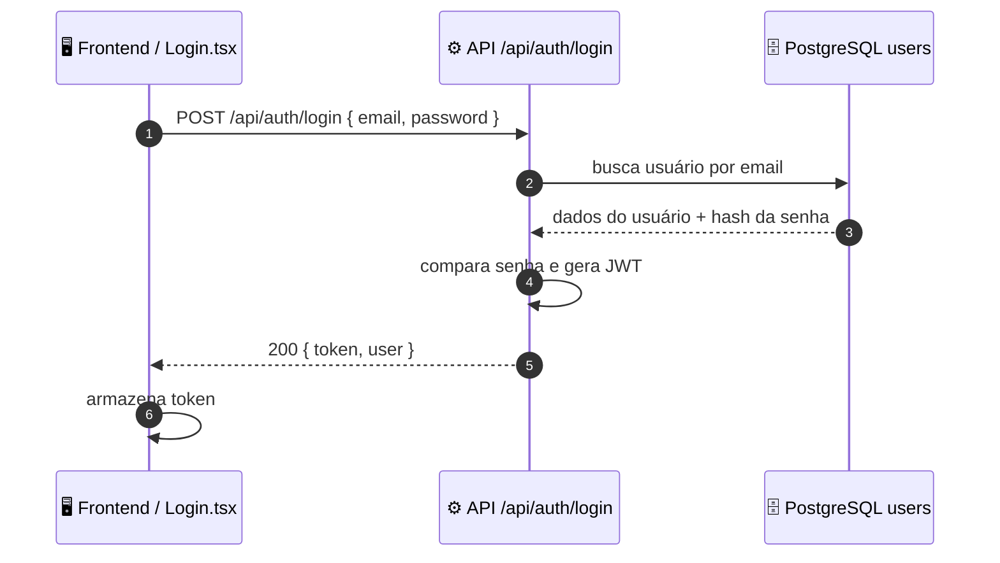

Depois do login, as rotas protegidas passam pelo middleware `RequireAuth`:

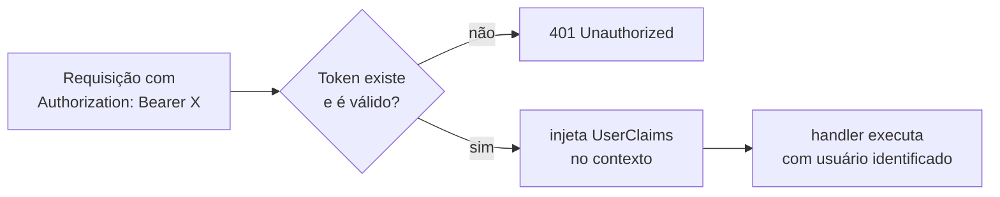

---

## 8. 🔄 Diagrama Dinâmico — Registrar um Sinistro

> Fluxo completo de ponta a ponta, do clique do usuário até a persistência no banco.

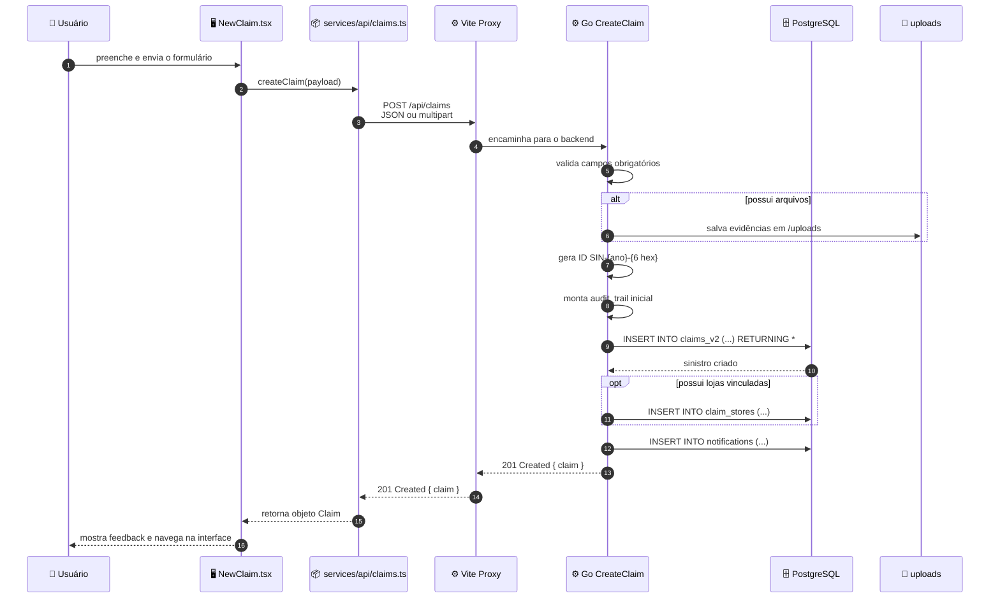

### Regras do fluxo

- A validação acontece antes da gravação no banco.
- Arquivos são salvos para que seus nomes/caminhos possam ser registrados no campo de evidências.
- O ID do sinistro segue o padrão `SIN-{ano}-{6 caracteres}`.
- A trilha de auditoria nasce junto com o sinistro.
- Quando existem lojas envolvidas, o relacionamento é salvo em tabela própria.
- Uma notificação automática pode ser criada com prioridade baseada na gravidade do sinistro.

---

## 9. 🧭 Ciclo de Vida de um Sinistro

> Representação simplificada dos estados principais de um sinistro.

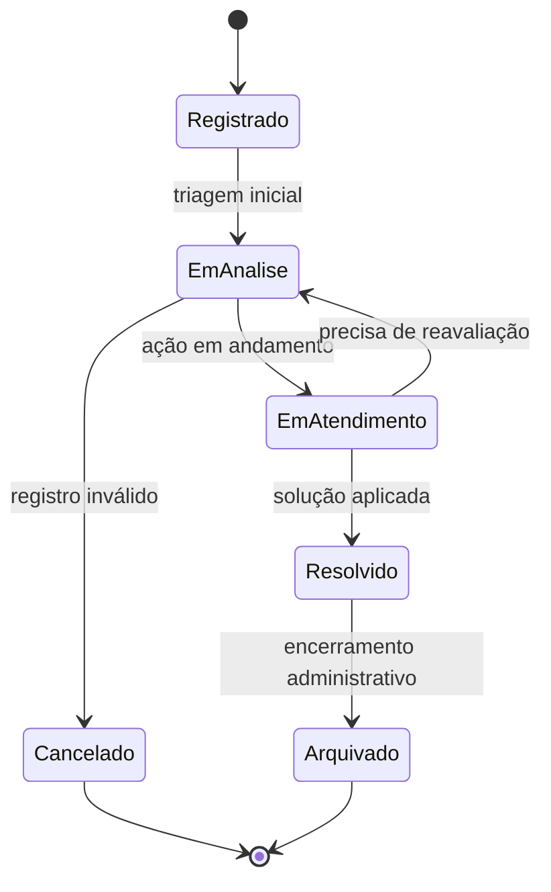

> Ajuste os nomes dos estados acima caso o banco utilize uma nomenclatura diferente, por exemplo `Em análise`, `Resolvido`, `Cancelado` ou outros valores padronizados pelo projeto.

---

## 10. 🗺️ Diagrama da Paisagem do Sistema

> Mostra o sistema e as ferramentas de apoio usadas pela equipe.

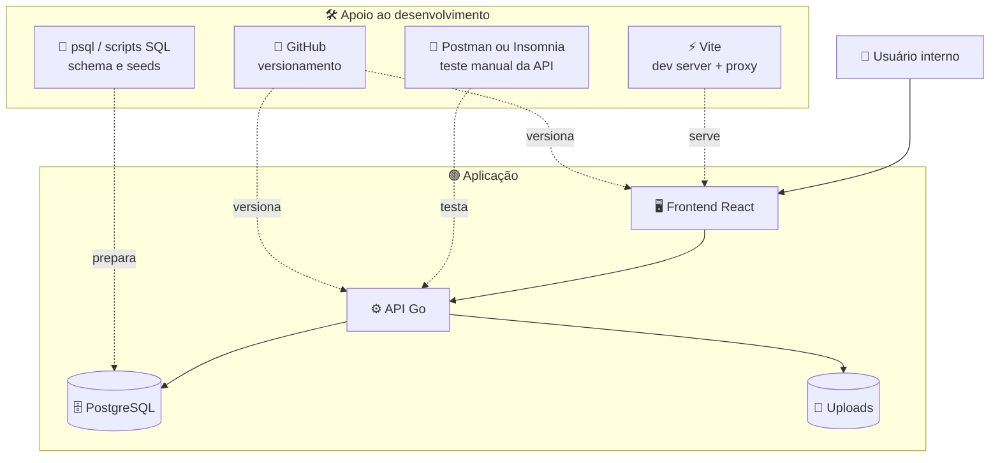

---

## 11. 🚀 Diagrama de Implantação

> Mostra onde cada parte roda durante o desenvolvimento local.

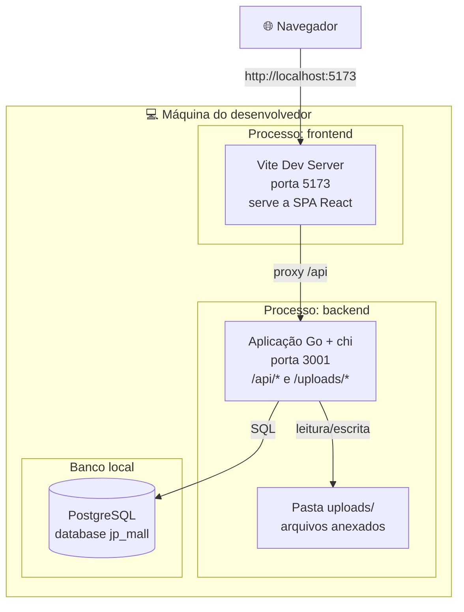

### Implantação sugerida para produção

Caso o projeto seja empacotado em contêineres, a estrutura recomendada é:

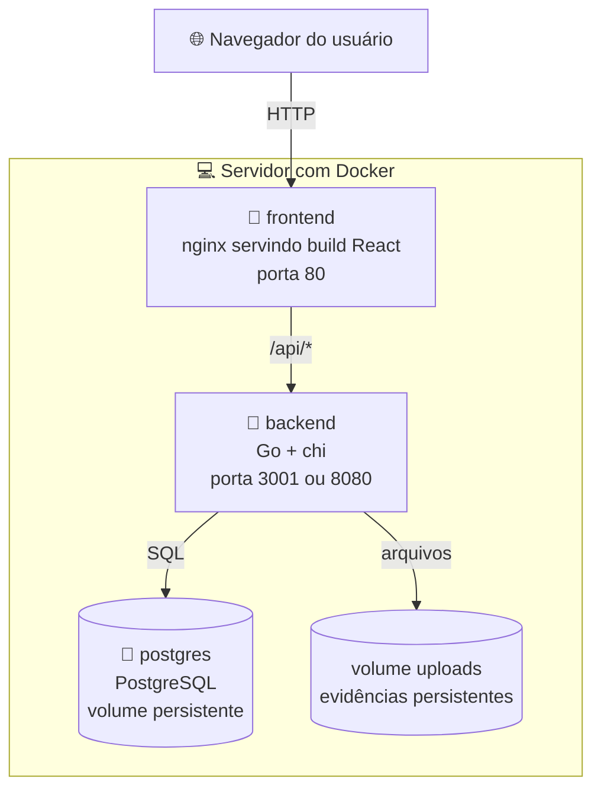

> A porta do backend deve ser padronizada entre frontend, proxy, `.env`, Docker e documentação.

---

## 12. 🧾 Mapa de Rotas da API

| Método | Rota | Auth | Responsabilidade |
|---|---|:---:|---|
| GET | `/api/health` | — | Verifica se a API está rodando. |
| POST | `/api/auth/login` | — | Realiza login e gera JWT. |
| GET | `/api/auth/me` | 🔒 | Retorna dados do usuário autenticado. |
| GET | `/api/claims` | — | Lista sinistros. |
| POST | `/api/claims` | 🔒 | Cria novo sinistro. |
| GET | `/api/claims/history` | — | Lista histórico de sinistros. |
| GET | `/api/claims/history/export` | — | Exporta histórico. |
| GET | `/api/claims/{id}` | — | Busca detalhes de um sinistro. |
| PUT | `/api/claims/{id}` | 🔒 | Atualiza um sinistro. |
| DELETE | `/api/claims/{id}` | 🔒 | Remove um sinistro. |
| POST | `/api/claims/{id}/audit` | 🔒 | Adiciona entrada de auditoria. |
| POST | `/api/claims/{id}/files` | 🔒 | Faz upload de evidências. |
| GET | `/api/claims/{id}/notification-data` | — | Busca dados para notificação. |
| GET | `/api/claims/{id}/whatsapp-link` | — | Gera link de WhatsApp. |
| GET | `/api/stores` | — | Lista lojas. |
| GET | `/api/stores/meta/segments` | — | Lista segmentos de lojas. |
| GET | `/api/stores/{id}` | — | Busca uma loja específica. |
| PUT | `/api/stores/{id}/contact` | — | Atualiza contato da loja. |
| GET | `/api/notifications` | — | Lista notificações. |
| POST | `/api/notifications` | — | Cria notificação. |
| PUT | `/api/notifications/{id}/read` | — | Marca notificação como lida. |
| PUT | `/api/notifications/read-all` | — | Marca todas como lidas. |
| GET | `/api/dashboard/stats` | — | Estatísticas gerais. |
| GET | `/api/dashboard/recent` | — | Sinistros recentes. |
| GET | `/api/dashboard/summary` | — | Resumo do dashboard. |
| GET | `/api/dashboard/monthly-claims` | — | Sinistros por mês. |
| GET | `/api/dashboard/monthly-sinistrality` | — | Sinistralidade mensal. |
| GET | `/api/dashboard/recent-activities` | — | Atividades recentes. |
| GET | `/api/reports/claims` | — | Dados para relatório de sinistros. |
| GET | `/api/reports/claims/pdf` | — | Exporta relatório em PDF. |
| GET | `/api/reports/claims/excel` | — | Exporta relatório em Excel. |
| GET | `/api/reports/final/pdf` | — | Exporta relatório final em PDF. |
| GET | `/api/reports/final/excel` | — | Exporta relatório final em Excel. |
| GET | `/uploads/*` | — | Serve evidências anexadas aos sinistros. |

---

## 13. 📁 Estrutura de Pastas Resumida

```text
CODIGO-main/
├── backend/                         # API REST em Go
│   ├── main.go                      # entrada: config → db → router chi → ListenAndServe
│   ├── config/
│   │   └── config.go                # lê .env e monta Config
│   ├── db/
│   │   └── db.go                    # pool pgx/v5 global
│   ├── middleware/
│   │   └── auth.go                  # RequireAuth: valida JWT
│   ├── handlers/                    # auth, claims, stores, notifications, dashboard, reports
│   ├── models/
│   │   └── models.go                # structs das entidades
│   ├── migrations/                  # SQL: users, claims, stores, seeds
│   └── uploads/                     # evidências servidas em /uploads/*
│
├── database/                        # schema, seeds e documentação de banco
│   ├── 001_schema.sql
│   ├── 002_seed_stores.sql
│   └── MANUAL.md
│
├── docs/                            # documentos auxiliares do projeto
│   ├── FLUXO_DE_DADOS.md
│   └── MANUAL_DE_INSTALACAO.md
│
└── frontend/                        # SPA React + Vite
    ├── vite.config.ts               # proxy /api → backend
    ├── index.html
    └── src/
        ├── main.tsx                 # monta a aplicação no #root
        ├── apiClient.ts             # reexporta serviços da API
        ├── services/api/            # camada única de fetch
        ├── types/                   # tipos TypeScript
        └── app/
            ├── App.tsx              # RouterProvider + Toaster
            ├── routes.tsx           # URL → página
            ├── pages/               # Login, Dashboard, NewClaim, Details, Reports
            └── components/          # Layout, Sidebar, shared e ui
```

---

## 14. ▶️ Como Rodar em Desenvolvimento

### 1. Preparar o banco

```bash
psql -U postgres -d jp_mall -f database/001_schema.sql
psql -U postgres -d jp_mall -f database/002_seed_stores.sql
```

### 2. Rodar o backend

```bash
cd backend
cp .env.example .env
go run .
```

Por padrão, o backend deve subir em:

```text
http://localhost:3001
```

Healthcheck:

```text
http://localhost:3001/api/health
```

### 3. Rodar o frontend

```bash
cd frontend
pnpm install
pnpm dev
```

Acesse:

```text
http://localhost:5173
```

---

## 15. ⚠️ Pontos de Atenção Técnica

| # | Onde | Problema | Ajuste recomendado |
|---|---|---|---|
| 1 | `frontend/vite.config.ts` | Proxy pode estar apontando para `http://localhost:8080`, enquanto o backend sobe em `:3001`. | Padronizar a porta. Ex.: `'/api': 'http://localhost:3001'`. |
| 2 | `services/api/auth.ts` | Login pode estar chamando `POST /api/login`. | Ajustar para `POST /api/auth/login`. |
| 3 | `services/api/notifications.ts` | Marcar notificação como lida pode estar usando `PATCH`. | Backend espera `PUT /api/notifications/{id}/read`. |
| 4 | `services/api/stores.ts` | Pode existir chamada para `/api/stores/search?q=`, rota não documentada no backend. | Usar rotas existentes ou criar endpoint de busca no backend. |
| 5 | `services/api/*` | Chamadas protegidas podem estar sem header `Authorization`. | Incluir `Authorization: Bearer <token>` em rotas protegidas. |
| 6 | Ambiente | Portas variam entre README, proxy, backend e Docker. | Definir um padrão único: `3001` em dev ou `8080` em Docker/produção. |

---

## 16. 🎨 Notação dos Diagramas

| Símbolo | Significado |
|---|---|
| 👤 | Pessoa/ator que interage com o sistema. |
| 🖥️ | Frontend ou interface visual. |
| ⚙️ | Backend, API ou serviço de regra de negócio. |
| 🗄️ | Banco de dados. |
| 📁 | Armazenamento de arquivos. |
| 🔒 | Recurso protegido por autenticação. |
| `-->` | Comunicação direta. |
| `-.->` | Relação indireta, apoio ou dependência auxiliar. |
| `subgraph` | Agrupamento lógico ou físico. |

---

## 17. ✅ Checklist de Revisão

- [x] Contexto do sistema documentado.
- [x] Usuário principal identificado.
- [x] Frontend, backend, banco e uploads separados em contêineres lógicos.
- [x] Comunicação frontend → API explicada.
- [x] Proxy `/api` do Vite explicado.
- [x] Componentes principais do backend descritos.
- [x] Componentes principais do frontend descritos.
- [x] Fluxo de autenticação JWT documentado.
- [x] Fluxo completo de criação de sinistro documentado.
- [x] Mapa de rotas da API incluído.
- [x] Estrutura de pastas resumida incluída.
- [x] Pontos de atenção técnica listados.
- [ ] Padronizar porta do backend entre `.env`, Vite e documentação.
- [ ] Garantir que rotas protegidas enviem token JWT.
- [ ] Confirmar se as rotas públicas devem continuar públicas ou se precisam de autenticação.
- [ ] Definir estratégia de persistência da pasta `/uploads` em produção.
- [ ] Revisar variáveis sensíveis antes de publicar o repositório.

---

## 18. ❓ FAQ

### 1. O que o JP Mall faz?

Gerencia sinistros e ocorrências de um shopping center, permitindo registrar eventos, acompanhar status, anexar evidências, vincular lojas, consultar notificações e gerar relatórios.

### 2. Quais tecnologias são usadas?

Frontend em **React + Vite + TypeScript**, backend em **Go + chi v5** e banco de dados **PostgreSQL** usando **pgx/v5**.

### 3. Por que o frontend chama `/api/...` em vez de `http://localhost:3001/api/...`?

Porque o projeto usa caminho relativo e pode contar com o proxy do Vite em desenvolvimento. Isso deixa a comunicação mais limpa e evita problemas de origem/CORS durante o desenvolvimento.

### 4. Onde os arquivos anexados aos sinistros ficam?

Na pasta `backend/uploads/`, servida pelo backend por meio da rota `/uploads/*`.

### 5. O sistema tem autenticação?

Sim. O login usa `POST /api/auth/login` e retorna um token JWT. As rotas protegidas devem receber o header `Authorization: Bearer <token>`.

### 6. Qual porta devo usar para o backend?

Pelo documento de arquitetura atual, o backend roda em `3001`. Porém, se o projeto ou Docker estiver configurado para `8080`, é preciso alinhar o Vite, `.env`, backend e documentação para uma única porta.

### 7. Onde devo salvar este arquivo?

Sugestão:

```text
docs/ARQUITETURA.md
```

ou, se quiser deixar visível na raiz do repositório:

```text
ARQUITETURA.md
```

---

## 🛠️ Construído com

- **React** — interface do usuário.
- **Vite** — servidor de desenvolvimento e build do frontend.
- **TypeScript** — tipagem do frontend.
- **React Router** — rotas da SPA.
- **shadcn/ui** — componentes visuais.
- **Go** — linguagem do backend.
- **chi v5** — roteador HTTP do backend.
- **JWT** — autenticação por token.
- **PostgreSQL** — banco de dados relacional.
- **pgx/v5** — driver/pool de conexão com PostgreSQL.
- **GitHub** — versionamento e documentação.

---

> Documento elaborado para servir como referência de arquitetura do projeto **JP Mall**. Atualize este arquivo sempre que houver mudança em rotas, tecnologias, portas, banco de dados, autenticação ou fluxo de dados.
