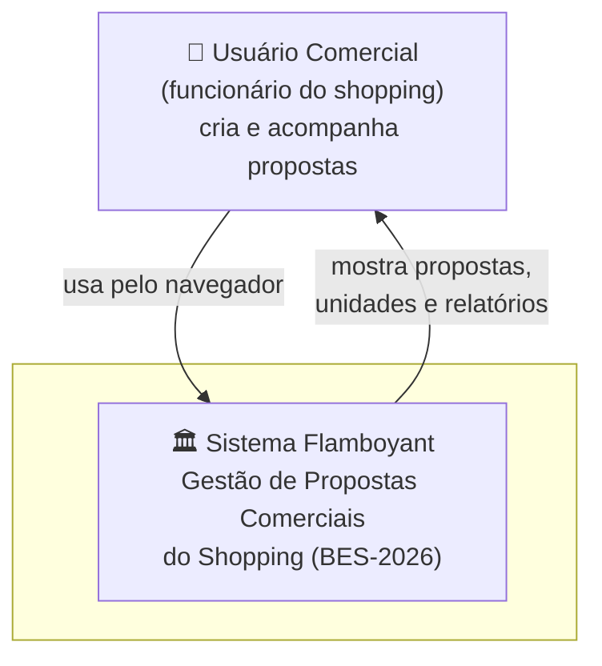
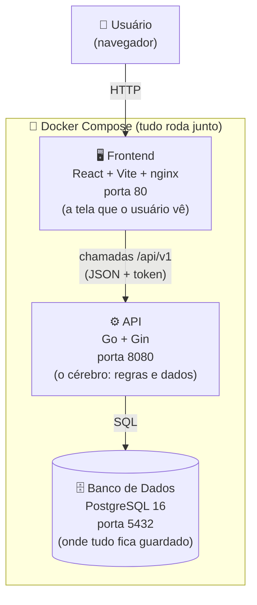
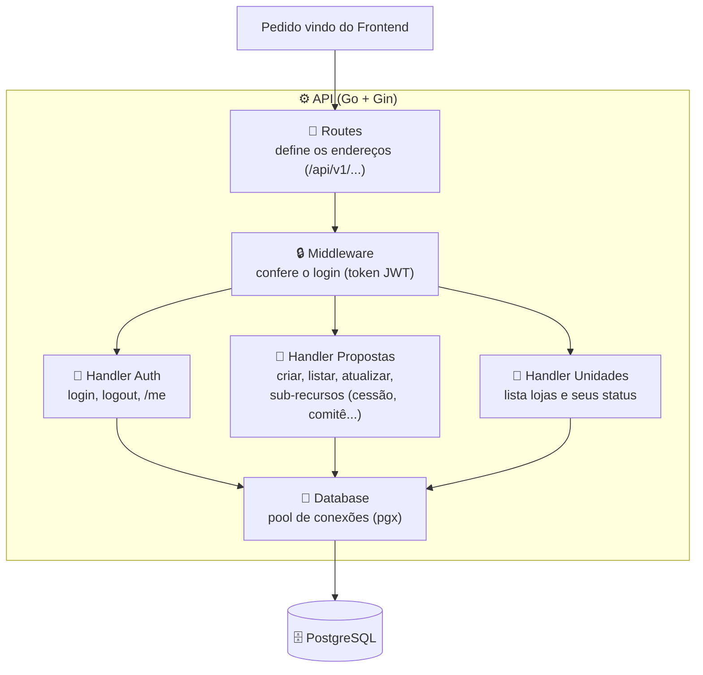
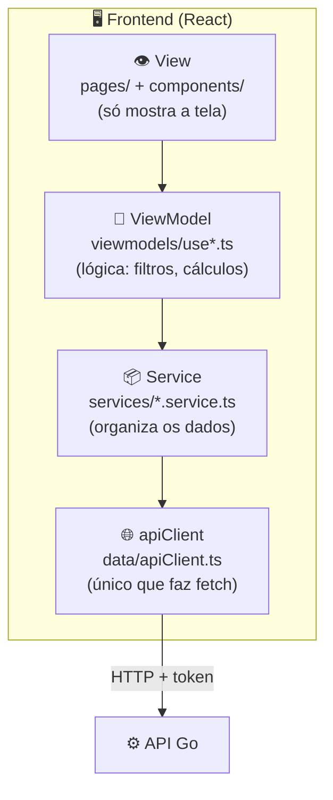
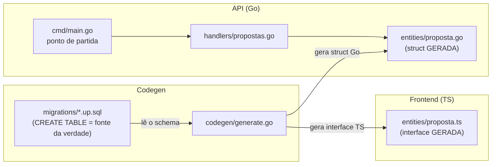
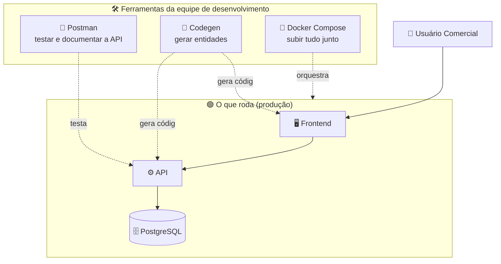
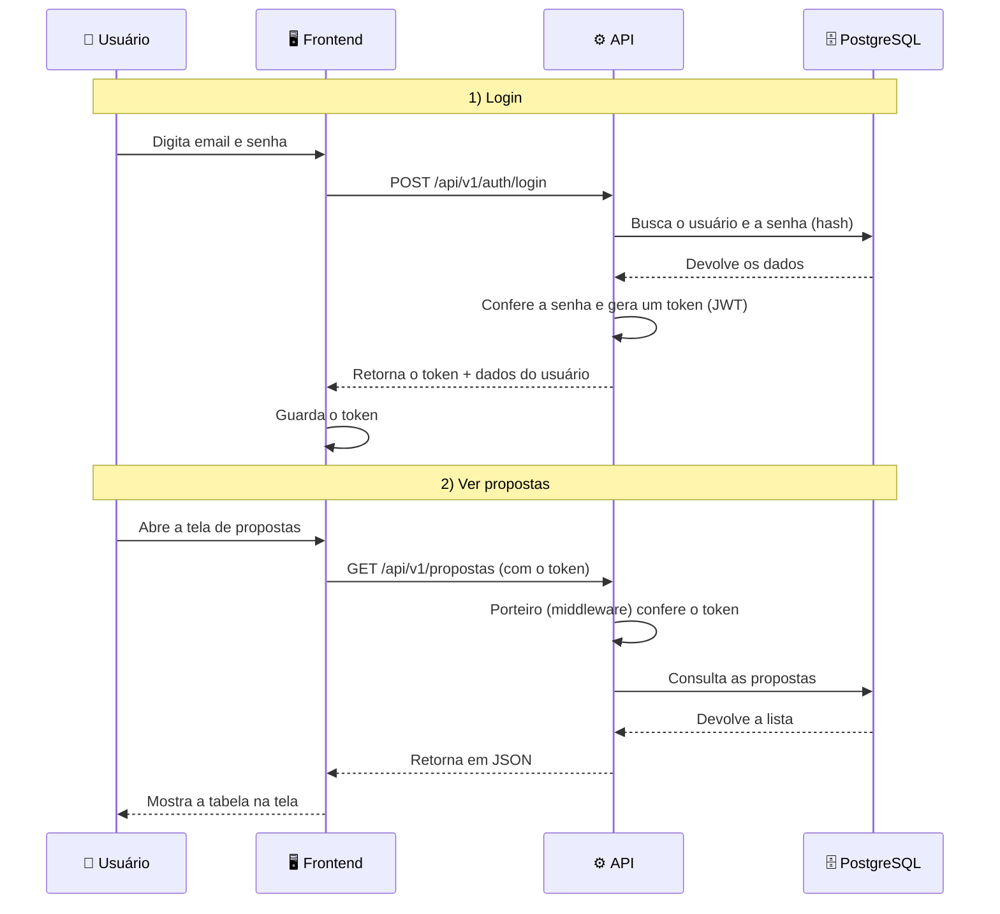
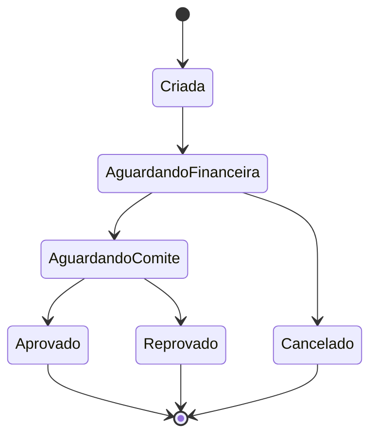
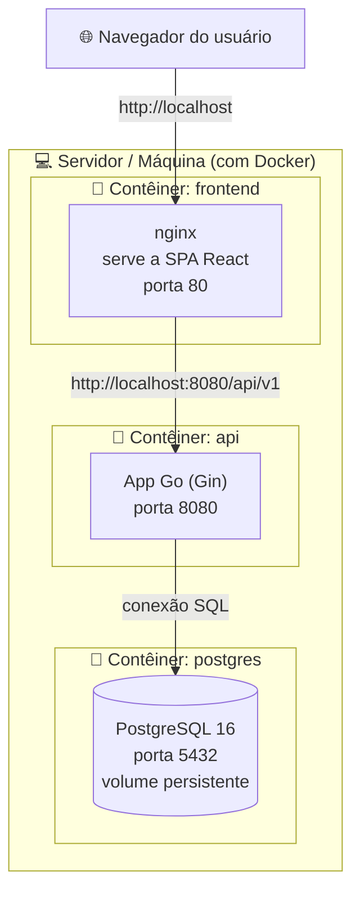

## . Estrutura de Pastas Resumida

```
Projeto-Flamboyant/
├── .env.example              ← variáveis de ambiente necessárias
├── docker-compose.yml        ← orquestração dos 3 serviços
│
├── API/                      ← Backend Go
│   ├── cmd/main.go           ← ponto de entrada: DB + rotas + servidor
│   ├── internal/
│   │   ├── config/           ← lê variáveis de ambiente
│   │   ├── database/         ← pool pgx + golang-migrate
│   │   ├── entities/         ← structs geradas pelo codegen (DO NOT EDIT)
│   │   ├── handlers/         ← lógica HTTP de cada recurso
│   │   ├── middleware/        ← auth JWT
│   │   └── routes/           ← registro de todos os endpoints
│   └── migrations/           ← 000001..000005 SQL up/down
│
├── Figma/                    ← Frontend React/Vite
│   └── src/app/
│       ├── data/             ← apiClient.ts, useApi hook
│       ├── entities/         ← interfaces TS geradas (DO NOT EDIT)
│       ├── services/         ← PropostasService, UnidadesService (Model)
│       ├── viewmodels/       ← hooks com lógica de negócio (ViewModel)
│       ├── pages/comercial/  ← telas do módulo comercial (View)
│       ├── components/       ← componentes reutilizáveis
│       ├── App.tsx           ← roteamento + AuthContext provider
│       └── AuthContext.tsx   ← estado global de autenticação
│
├── codegen/
│   └── generate.go           ← lê migrations SQL, gera .go e .ts
│
├── entities/                 ← fonte intermediária (copiada para API e Figma)
│
└── postman/                  ← coleções, specs OpenAPI, mocks para testes
```


# 🏛️ Arquitetura C4 — Projeto Flamboyant - JP MALL

> Este documento descreve a arquitetura do **Projeto Flamboyant** usando o **C4 Model**, 
---

## 📖 O que é o JP MALL

O **JP MALL** é um sistema de **gestão de propostas comerciais** de um shopping center.

Sobre a gestão de propostas comerciais do grupo 6:
De forma resumida: imagine um shopping com várias **lojas/unidades**. Quando um lojista quer alugar um espaço, é criada uma **proposta comercial**. Essa proposta passa por várias etapas — análise financeira, aprovação de um comitê — até ser aprovada ou recusada. O sistema serve para **acompanhar e gerenciar todo esse caminho**.

---

## 🧭 O que é o C4 Model? (resumo rápido)

O C4 é como o **Google Maps de um software**. Você começa vendo o "mundo" e vai dando zoom diminuindo o escopo:

| Nível | Nome | Pergunta que responde |
|-------|------|------------------------|
| 1 | **Contexto** | Quem usa o sistema e com o que ele conversa? |
| 2 | **Contêiner** | Quais são as "peças grandes" (apps, bancos) que formam o sistema? |
| 3 | **Componente** | O que tem dentro de cada peça? |
| 4 | **Código** | Como o código está organizado lá no fundo? |

Além desses 4 níveis principais, este documento também traz diagramas extras (paisagem, dinâmico e implantação) para completar a visão.

---

## 1. 🌍 Diagrama de Contexto do Sistema
> **Visão mais distante.** Mostra o sistema como uma caixa única e quem interage com ele.



**Resumindo:**
- O **usuário comercial** acessa o sistema pelo navegador.
- O **Sistema Flamboyant** guarda e organiza todas as propostas e unidades do shopping.
- Hoje o sistema é "fechado" — não depende de outros sistemas externos para funcionar (ele cuida do seu próprio login e do seu próprio banco de dados).

---

## 2. 📦 Diagrama de Contêiner
> **Dando um zoom.** Abrimos a "caixa única" e vemos as **3 grandes peças** que formam o sistema. Cada peça roda dentro do Docker.



**As 3 peças (contêineres):**

| Peça | Tecnologia | Para que serve |
|------|-----------|----------------|
| **Frontend** | React 18 + Vite + Tailwind, servido pelo nginx | É a interface visual — telas, botões, gráficos e tabelas. |
| **API** | Go 1.25 + Gin | É o "cérebro": recebe pedidos, aplica regras e fala com o banco. |
| **Banco de Dados** | PostgreSQL 16 | Guarda permanentemente propostas, unidades e usuários. |

Tudo é iniciado junto com um único comando: `docker compose up --build`.

---

## 3. 🧩 Diagrama de Componentes
> **Mais zoom ainda.** Agora abrimos as peças "Frontend" e "API" para ver o que existe dentro de cada uma.

### 3.1 Componentes da API (Go)



**Resumindo:**
- **Routes**: a "lista de endereços" da API (ex: `/api/v1/propostas`).
- **Middleware**: o "porteiro" que confere se o usuário está logado antes de deixar passar.
- **Handlers**: cada um cuida de um assunto — login, propostas ou unidades.
- **Database**: o canal que conversa com o banco de dados.

### 3.2 Componentes do Frontend (React — padrão MVVM)

O frontend é organizado em camadas separadas (padrão MVVM), cada uma com uma responsabilidade clara:



| Camada | Papel (analogia) |
|--------|------------------|
| **View** | O "rosto" — só exibe e recebe cliques, não pensa. |
| **ViewModel** | O "raciocínio" — filtra, ordena, calcula KPIs. |
| **Service** | O "organizador" — arruma os dados vindos da API. |
| **apiClient** | O "carteiro" — o único que realmente envia pedidos à API. |

Vantagem: se a API mudar de endereço, **só o apiClient muda**. O resto continua igual.

---

## 4. 🔬 Diagrama de Código
> **O nível mais profundo.** Mostra como o código está organizado por dentro — pastas e arquivos principais. Aqui usamos o exemplo do fluxo de uma **Proposta**.



**Geração automática (Codegen)**

Existe um mecanismo para **Go e TypeScript nunca ficarem fora de sincronia**:
1. Cada tabela é definida uma única vez no SQL (`migrations/*.up.sql`) — essa é a **fonte da verdade**.
2. O programa `codegen/generate.go` lê esse SQL.
3. Ele gera automaticamente as `structs` em Go **e** as `interfaces` em TypeScript.

Por isso, os arquivos dentro de `entities/` **nunca devem ser editados à mão** — eles têm o aviso `// Code generated — DO NOT EDIT`. Para mudar algo, muda-se o SQL e roda-se o script `ajustar entidades via migration.ps1`.

---

## 5. 🗺️ Diagrama da Paisagem do Sistema (System Landscape)
> Uma visão "de cima" mostrando o sistema dentro do seu ambiente, incluindo as ferramentas de apoio usadas pela equipe (mesmo que não façam parte do que roda em produção).



**Em palavras simples:** além das 3 peças que rodam de verdade, a equipe usa o **Postman** (para testar a API), o **Codegen** (para gerar código) e o **Docker** (para ligar tudo de uma vez).

---

## 6. 🔄 Diagrama Dinâmico
> Mostra o **passo a passo de uma ação real**, na ordem em que as coisas acontecem. Aqui: o usuário faz **login** e depois **lista as propostas**.



**Observação importante (modo protótipo):** atualmente, para facilitar o desenvolvimento, a conferência de login está **temporariamente desligada** — o sistema usa um usuário fixo (`proto-001`). O login real (com senha criptografada e token) já está pronto e pode ser reativado quando for para produção.

### Ciclo de vida de uma proposta

Como bônus do fluxo dinâmico, veja os estados pelos quais uma proposta passa:



---

## 7. 🚀 Diagrama de Implantação (Deployment)
> Mostra **onde** cada peça realmente roda — em qual máquina, em qual contêiner e em qual porta.



**Resumindo:**
- Tudo é empacotado em **3 contêineres Docker** que rodam na mesma máquina.
- O usuário acessa o **frontend** em `http://localhost` (porta 80).
- O frontend conversa com a **API** na porta 8080.
- A API guarda os dados no **PostgreSQL** (porta 5432), que tem um volume para não perder os dados quando reinicia.

---

## 8. 🎨 Notação (legenda dos diagramas)

Para ler os diagramas deste documento, use esta legenda simples:

| Símbolo / Forma | Significado |
|-----------------|-------------|
| 👤 (ator) | Uma **pessoa** que usa o sistema |
| Caixa retangular | Uma **peça de software** (app, serviço ou componente) |
| Cilindro `[( )]` | Um **banco de dados** |
| `subgraph` (caixa em volta) | Um **agrupamento** (ex: tudo dentro do Docker) |
| Seta cheia `-->` | Um **fluxo / chamada direta** entre duas peças |
| Seta tracejada `-.->` | Uma **relação de apoio** (ferramenta, geração, orquestração) |
| Texto na seta | **O que** está sendo enviado (ex: "JSON + token") |

**Cores/emojis usados:** 🖥️ frontend · ⚙️ API · 🗄️ banco · 🔒 segurança · 🐳 Docker · 🛠️ ferramentas. São apenas para ajudar a leitura, não têm significado técnico extra.

---

## 9. ✅ Lista de Verificação de Revisão
Use esta lista para conferir se a arquitetura está bem entendida e bem documentada:

- [x] **Contexto claro** — está explícito quem usa o sistema (usuário comercial) e para quê.
- [x] **Peças identificadas** — os 3 contêineres (frontend, API, banco) estão descritos com tecnologia e porta.
- [x] **Componentes mapeados** — API (routes, middleware, handlers) e frontend (View, ViewModel, Service, apiClient).
- [x] **Fluxo de dados** — está claro como um pedido viaja do navegador até o banco e volta.
- [x] **Segurança** — autenticação por token JWT documentada (e a nota do modo protótipo).
- [x] **Geração de código** — o mecanismo de codegen e a regra "não editar entities" estão explicados.
- [x] **Implantação** — como rodar (Docker Compose) e em quais portas.
- [ ] **Pontos a evoluir** — reativar a validação real de JWT antes de ir para produção.
- [ ] **Pontos a evoluir** — definir variáveis sensíveis (`JWT_SECRET`, `DB_PASSWORD`) fora do código em produção.

---

## 10. ❓ Perguntas Frequentes (FAQ)
**1. O que o Projeto Flamboyant faz, em uma frase?**
Gerencia propostas comerciais de lojas de um shopping, do momento em que são criadas até a aprovação ou recusa.

**2. Quais tecnologias o projeto usa?**
Backend em **Go (Gin)**, frontend em **React (Vite + Tailwind)** e banco de dados **PostgreSQL**, tudo rodando em **Docker**.

**3. Preciso instalar Go, Node e PostgreSQL para rodar?**
Não. Basta ter o **Docker** e rodar `docker compose up --build`. O Docker cuida de tudo.

**4. Por que não posso editar os arquivos da pasta `entities/`?**
Porque eles são **gerados automaticamente** a partir do SQL das migrations. Se você editar à mão, sua mudança será apagada na próxima geração. O certo é mudar o SQL e rodar o codegen.

**5. O sistema tem login de verdade?**
Sim, o login com senha criptografada e token JWT já está implementado. Porém, no momento, ele está **temporariamente desligado** (modo protótipo) usando um usuário fixo, para facilitar o desenvolvimento da interface.

**6. O que é o padrão MVVM usado no frontend?**
É uma forma de **separar responsabilidades**: a tela (View) só mostra, a lógica (ViewModel) pensa, o serviço (Service) organiza os dados e o apiClient faz a comunicação. Isso deixa o código mais fácil de manter.

**7. Onde os dados ficam guardados?**
No banco **PostgreSQL**, dentro de um contêiner Docker com um volume — ou seja, os dados continuam salvos mesmo se a aplicação reiniciar.

**8. Como faço para acessar a aplicação depois de subir?**
- Site (frontend): `http://localhost`
- API: `http://localhost:8080`
- Healthcheck da API: `http://localhost:8080/health`

---

*Documento C4 elaborado com base no `README.md` e no `repomix-output.md` do projeto. Para mantê-lo atualizado, revise-o sempre que a arquitetura mudar (novos serviços, novas peças ou mudança no fluxo).*

## 🛠️ Construído com

- [React](https://react.dev) `18.3.1` — Framework principal do frontend
- [Vite](https://vitejs.dev) `6.3.5` — Bundler e servidor de desenvolvimento
- [TypeScript](https://www.typescriptlang.org) — Tipagem estática
- [Tailwind CSS](https://tailwindcss.com) `4.1.12` — Estilização
- [shadcn/ui](https://ui.shadcn.com) + [Radix UI](https://www.radix-ui.com) — Componentes de interface
- [React Router](https://reactrouter.com) `7.13.0` — Roteamento
- [Recharts](https://recharts.org) — Gráficos e visualizações
- [React Hook Form](https://react-hook-form.com) — Gerenciamento de formulários
- [Go](https://go.dev) `1.21+` — Linguagem da API
- [Gin](https://gin-gonic.com) — Framework web para a API
- [Postman](https://www.postman.com) — Testes e documentação da API

---

## ✒️ Autores
- **DanielNovaiz** — [github.com/DanielNovaiz](https://github.com/DanielNovaiz)
- **Felipe Fernandes** — [github.com/FELIIPE505](https://github.com/FELIIPE505)
- **Herlison Silva Assunção** — [github.com/herli-son-ufg](https://github.com/herli-son-ufg)
- **Matheus-slvmr** — [github.com/Matheus-slvmr](https://github.com/Matheus-slvmr)
- **militao-discente** — [github.com/militao-discente](https://github.com/militao-discente)


# Projeto-Flamboyant — Guia de execução com Docker
Este repositório contém:
- `API/`: backend em Go
- `Figma/`: frontend React/Vite
- `docker-compose.yml`: orquestração Docker para PostgreSQL, API e frontend

## Visão geral
A forma recomendada de executar o projeto é usando Docker e Docker Compose. O compose já define:
- um banco PostgreSQL em `postgres:16-alpine`
- a API Go em `API/Dockerfile`
- o frontend estático servido por nginx a partir de `Figma/Dockerfile`

## Requisitos
- Docker instalado
- Docker Compose disponível (`docker compose` ou `docker-compose`)
- Git instalado
> Não é necessário ter Go, Node ou PostgreSQL instalados localmente para rodar o projeto via Docker.

## Passo 1 — Clonar o repositório
```bash
git clone <URL-do-repositório>
cd Projeto-Flamboyant
```

## Passo 2 — Configurar variáveis de ambiente
O compose usa variáveis de ambiente do shell. As principais são:

- `DB_USER` (padrão: `postgres`)
- `DB_PASSWORD` (padrão: `postgres`)
- `DB_NAME` (padrão: `jp-mall`)
- `JWT_SECRET` (obrigatório para a API)
- `SERVER_PORT` (padrão: `8080`)
- `VITE_API_URL` (padrão: `http://localhost:8080/api/v1`)

### Exemplo de arquivo `.env`
Crie um arquivo `.env` na raiz do projeto com:

```env
DB_USER=postgres
DB_PASSWORD=postgres
DB_NAME=jp-mall
JWT_SECRET=uma-chave-secreta
SERVER_PORT=8080
VITE_API_URL=http://localhost:8080/api/v1
```

> Se não houver arquivo `.env`, o compose usará os valores padrão para `DB_USER`, `DB_PASSWORD`, `DB_NAME`, `SERVER_PORT` e `VITE_API_URL`, mas `JWT_SECRET` deverá estar definido no ambiente ou no `.env`.

## Passo 3 — Executar com Docker Compose
No terminal, na pasta raiz do repositório:

```bash
docker compose up --build
```

Isso fará:
- criar/atualizar a imagem do backend Go
- criar/atualizar a imagem do frontend React/Vite
- subir o banco PostgreSQL, o backend e o frontend

## Passo 4 — Verificar se os containers subiram
Os serviços disponíveis são:
- `postgres` → banco de dados PostgreSQL
- `api` → backend Go na porta `8080`
- `frontend` → site na porta `80`

Use este comando para ver o status:

```bash
docker compose ps
```

## Passo 5 — Acessar a aplicação
- Frontend: `http://localhost`
- API: `http://localhost:8080`

### Rotas úteis

- `http://localhost/` — interface React
- `http://localhost:8080/health` — healthcheck da API
- `http://localhost:8080/api/v1` — prefixo da API

## Passo 6 — Parar e remover os containers
Para interromper sem remover volumes:

```bash
docker compose stop
```

Para interromper e remover containers, redes e volumes anônimos:

```bash
docker compose down
```

Para remover também os volumes persistidos do PostgreSQL:

```bash
docker compose down -v
```

## Observações úteis

- A API depende do serviço `postgres` e aguarda o banco estar pronto antes de iniciar.
- O frontend é servido por nginx na porta `80`.
- O compose expõe o PostgreSQL na porta `5432` para acesso local, mas isso não é necessário para o funcionamento da aplicação.

## Debug e desenvolvimento local (opcional)

Se quiser rodar sem Docker, o projeto também pode ser executado localmente:

### Backend local

```bash
cd API
go mod tidy
go run cmd/main.go
```

### Frontend local

```bash
cd Figma
npm install
npm run dev
```

## Problemas comuns

- `docker compose` não encontrado: instale Docker Desktop ou Docker Engine com Compose.
- `JWT_SECRET` não definido: defina no `.env` ou no ambiente do Docker.
- Porta `80` em uso: pare o serviço local que usa porta 80 ou altere o bind port em `docker-compose.yml`.
- Erro de conexão com PostgreSQL: confira `DB_USER`, `DB_PASSWORD` e `DB_NAME` no `.env`.

## Mais informações

- `docker-compose.yml` configura os serviços `postgres`, `api` e `frontend`
- `API/Dockerfile` constrói o backend Go
- `Figma/Dockerfile` constrói o frontend React e serve via nginx

